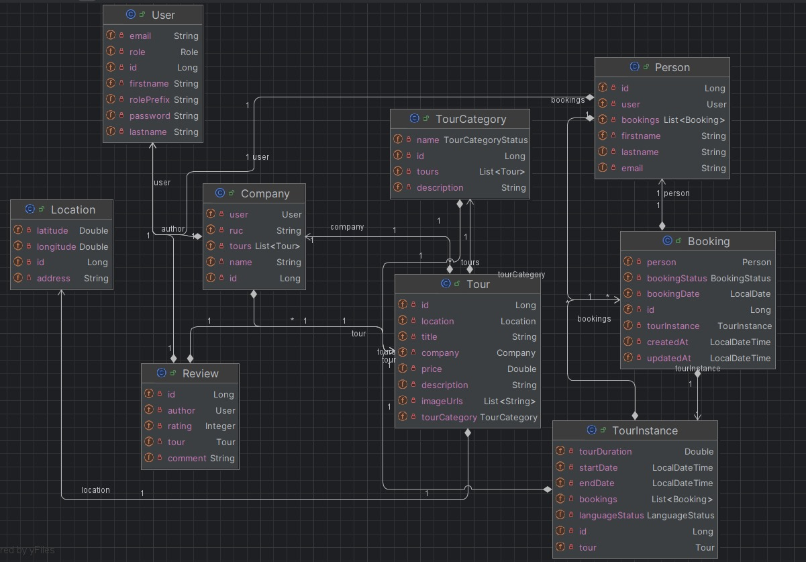

# Portada

Título: TourPlus

¡Bienvenidos a TourPlus! En un mundo donde la planificación de viajes puede ser abrumadora y desorganizada, nuestra
plataforma se presenta como la solución integral que todos los viajeros estaban esperando. TourPlus es una aplicación
web y móvil intuitiva diseñada para facilitar la exploración, comparación y reserva de tours turísticos de manera
sencilla y eficiente.

Nombre del curso: CS 2031 Desarrollo Basado en Plataforma.

Integrantes: 
- Jhon Erick Chilo Gonzales
- Paris Lenard Herrera Torres
- Isaac Percy Gamero Del Aguila
- Michael Antonio Castillo Melchor

IP del Deployment: 34.226.242.64

.jpg)

.jpg)

# Índice

1. [Introducción](#Introducción)
2. [Identificación del Problema o Necesidad](#Identificación-del-Problema-o-Necesidad)
3. [Descripción de la Solución](#Descripción-de-la-Solución) 
4. [Modelo de Entidades](#Modelo-de-Entidades)
5. [Testing y Manejo de Errores](#Testing-y-Manejo-de-Errores)
6. [Medidas de Seguridad Implementadas](#Medidas-de-Seguridad-Implementadas)
7. [Eventos y Asincronía](#Eventos-y-Asincronía)
8. [GitHub](#GitHub)
9. [Conclusión](#Conclusión)
10. [Licencia](#Licencia)

# Introducción

Contexto: 
La falta de una plataforma consolidada que ofrezca exploración, comparación y reserva de tours de manera integral puede llevar a una experiencia de usuario fragmentada y frustrante. Los usuarios a menudo deben navegar por múltiples sitios y aplicaciones para obtener la información necesaria, lo que puede ser ineficiente y tedioso. Abordar esta problemática mediante el desarrollo de TourPlus permitirá a los usuarios acceder a una solución “todo en uno”, mejorando la facilidad de planificación y reserva de sus viajes.

Objetivos del Proyecto:
- Desarrollar una plataforma web y móvil intuitiva que permita a los usuarios explorar y comparar una amplia gama de tours turísticos en diversas localidades de manera fácil y rápida.
- Implementar un sistema de recomendaciones personalizadas basado en las preferencias y el historial de los usuarios para ofrecer sugerencias relevantes y mejorar la experiencia de búsqueda.
- Implementar un sistema de pago en línea seguro que permita a los usuarios realizar reservas y pagos de tours de forma segura.
- Incorporar un sistema de reseñas y comparaciones que permita a los usuarios leer opiniones de otros viajeros y comparar diferentes opciones de tours para tomar decisiones informadas.
- Asegurar la disponibilidad en tiempo real de los tours mediante la integración de APIs, proporcionando a los usuarios información actualizada y precisa sobre la disponibilidad de las ofertas.

# Identificación del Problema o Necesidad

Descripción del Problema:

Los viajeros enfrentan dificultades al intentar planificar sus tours debido a la falta de plataformas que integren funcionalidades como búsqueda, comparaciones y pagos seguros en un solo lugar. Esto resulta en problemas al momento de viajar y hacer tours.

Justificación:

Actualmente, los viajeros a menudo enfrentan dificultades al intentar encontrar y reservar tours debido a la falta de plataformas que integren todas las funcionalidades necesarias en un solo lugar. TourPlus ofrece una solución completa que combina búsqueda, recomendaciones, pagos seguros y comparaciones en una única plataforma, mejorando la experiencia del usuario y facilitando la planificación de viajes.

# Descripción de la Solución

## Funcionalidades Clave:

- **Barra de Búsqueda y Recomendaciones:** Encuentra tours por destino y muestra recomendaciones principales.
- **Listado de Tours Disponibles:** Muestra opciones de tours disponibles basados en la ubicación ingresada.
- **Filtros de Búsqueda:** Filtra tours por categorías como aventura o cultura.
- **Detalles del Tour:** Muestra imágenes, descripción, horarios y precios del tour seleccionado.
- **Reserva de Tours:** Realiza reservas seleccionando idioma y tipo de Tour.
- **Gestión de Perfiles de Usuario:** Permite registrar, iniciar sesión y gestionar información personal y reservas.
- **Comentarios y Valoraciones:** Los usuarios pueden dejar opiniones y puntuaciones sobre los tours.

## Tecnologías Utilizadas:

- **Backend:** Spring Boot, Java, PostgreSQL, Docker, Testcontainers.
- **Deployment en cloud:** Amazon Web Services (AWS) 

# Modelo de Entidades

## Diagrama de Entidades

## Descripción de Entidades

En **TourPlus**, las entidades principales son:

1. **User**
  - **Atributos**: `id`, `email`, `password`, `role`, `firstname`, `lastname`, `rolePrefix`.
  - **Relaciones**: Se relaciona uno a uno con `Person` y `Company`.

2. **Person**
  - **Atributos**: `id`, `firstname`, `lastname`, `email`.
  - **Relaciones**: Uno a muchos con `Booking`.

3. **Company**
  - **Atributos**: `id`, `name`, `ruc`.
  - **Relaciones**: Uno a muchos con `Tour`.

4. **Tour**
  - **Atributos**: `id`, `title`, `description`, `price`, `imageUrls`.
  - **Relaciones**: Muchos a uno con `Company`, uno a muchos con `Review`, y pertenece a `TourCategory`.

5. **TourCategory**
  - **Atributos**: `id`, `name`, `description`.
  - **Relaciones**: Uno a muchos con `Tour`.

6. **Booking**
  - **Atributos**: `id`, `bookingDate`, `bookingStatus`.
  - **Relaciones**: Muchos a uno con `Person`, uno a uno con `TourInstance`.

7. **TourInstance**
  - **Atributos**: `id`, `startDate`, `endDate`, `tourDuration`.
  - **Relaciones**: Uno a muchos con `Booking`.

8. **Location**
  - **Atributos**: `id`, `latitude`, `longitude`, `address`.
  - **Relaciones**: Uno a uno con `Tour`.

9. **Review**
  - **Atributos**: `id`, `rating`, `comment`.
  - **Relaciones**: Muchos a uno con `User` y `Tour`.

## Resumen de Relaciones
- Un `User` es una `Person` o `Company`.
- Un `Person` tiene múltiples `Booking`.
- Una `Company` ofrece múltiples `Tour`.
- Un `Tour` tiene múltiples `Review` y pertenece a una `TourCategory`.
- Un `Booking` se asocia a una `TourInstance`.
- Cada `Tour` tiene una `Location`.

# Testing y Manejo de Errores

**Niveles de Testing Realizados**

En TourPlus, hemos llevado a cabo diversos niveles de pruebas para asegurar la calidad del software. Los niveles de prueba realizados incluyen:

1. **Pruebas Unitarias**: Se han implementado pruebas unitarias para las entidades y DTOs, asegurando que cada componente funcione correctamente de manera aislada. Se han realizado pruebas exhaustivas para las clases `User`, `Person`, `Booking`, y `Review`.

2. **Pruebas de Integración**: Se han realizado pruebas de integración en componentes críticos como el controlador de autenticación y las reservas. Estas pruebas verifican la interacción entre múltiples componentes, como los controladores, servicios y repositorios, asegurando que funcionen correctamente en conjunto.

3. **Pruebas del Sistema**: Se han llevado a cabo pruebas del sistema para validar el comportamiento general de la aplicación en su conjunto. Esto incluye la verificación de flujos de trabajo completos, como la creación de un usuario, la realización de una reserva y la gestión de reseñas.

4. **Pruebas de Aceptación**: Aunque estas pruebas están planificadas, se enfocarán en validar si el sistema cumple con los requisitos del usuario y las expectativas establecidas en el proyecto. Se basarán en la retroalimentación de los usuarios y las especificaciones del proyecto.

**Resultados**

Los resultados de las pruebas han sido positivos, con un alto porcentaje de éxito en las pruebas unitarias e integración. Sin embargo, se han identificado y corregido algunos errores significativos:

- **Errores en la Validación de Entradas**: Se encontraron problemas con la validación de datos al crear usuarios y realizar reservas, lo que llevó a mejoras en las validaciones en los DTOs.

- **Problemas de Concurrencia**: Durante las pruebas de integración, se identificaron problemas de concurrencia en la gestión de reservas, que fueron solucionados mediante el uso de mecanismos de sincronización.

- **Manejo de Excepciones**: Se identificaron casos donde no se manejaban adecuadamente las excepciones, lo que podría causar que la aplicación fallara. Se implementaron mejores prácticas de manejo de errores.

**Manejo de Errores**

En TourPlus, hemos implementado excepciones globales para manejar errores de manera eficiente y coherente. Las excepciones más relevantes incluyen:

- **`UserAlreadyExistException`**: Utilizada para manejar el caso en el que un usuario intenta registrarse con un correo electrónico que ya existe. Esta excepción proporciona un mensaje claro y específico al usuario.

- **`UsernameNotFoundException`**: Se utiliza para manejar situaciones en las que un usuario intenta acceder a su cuenta con un nombre de usuario que no se encuentra en el sistema. Esto asegura que los usuarios reciban retroalimentación clara y precisa.

- **`ResourceNotFoundException`**: Se utiliza para manejar situaciones en las que un recurso solicitado no se encuentra (por ejemplo, un tour o una reserva que no existe). Esto ayuda a evitar errores no manejados y proporciona respuestas adecuadas a los usuarios.

- **`IllegalArgumentException`**: Esta excepción se utiliza para manejar argumentos inválidos que se pasan a los métodos. Garantiza que se validen los datos antes de procesarlos, previniendo errores en tiempo de ejecución.

- **Excepciones de Validación**: Se manejan errores de validación de forma global para asegurar que todos los datos ingresados por los usuarios sean válidos y seguros antes de ser procesados.

El manejo adecuado de excepciones es crucial para mejorar la experiencia del usuario y la estabilidad de la aplicación. Permite que el sistema responda de manera controlada a situaciones inesperadas y proporcione mensajes de error útiles, en lugar de fallos abruptos que pueden confundir a los usuarios.

# Medidas de Seguridad Implementadas:

## Uso de JWT para Autenticación
- **JWT (JSON Web Token)** es un estándar seguro para intercambiar información entre un cliente y un servidor de manera compacta y auto-contenida. Esta clase genera, verifica y valida tokens JWT, lo cual permite que los usuarios autenticados realicen solicitudes a la aplicación.

## Cifrado del Token JWT:
- Se utiliza el algoritmo **HMAC256** para firmar los tokens JWT. Este algoritmo simétrico asegura que el token no puede ser alterado sin la clave secreta (almacenada en la propiedad jwt.secret).
La clave secreta se inyecta en el servicio usando la anotación @Value("${jwt.secret}"), lo que garantiza que no esté expuesta directamente en el código fuente.

## Fecha de Expiración de Tokens:
- Los tokens generados incluyen una fecha de expiración (withExpiresAt). En este caso, el token es válido por 10 horas. Esto previene el uso de tokens viejos o robados después de que hayan caducado

# Eventos y Asincronía:

**Eventos Utilizados**

En TourPlus, hemos implementado eventos clave que mejoran la funcionalidad de la plataforma. Los principales eventos utilizados son:

1. **Evento de Reserva de Tour**: Se dispara cuando un usuario realiza una reserva de tour. Este evento permite llevar a cabo acciones adicionales, como enviar notificaciones de confirmación a los usuarios y actualizar el estado de disponibilidad del tour.

2. **Evento de Creación de Usuario**: Se activa cuando un nuevo usuario se registra en la plataforma. Esto permite la generación de notificaciones de bienvenida y la configuración inicial del perfil del usuario.

**Importancia de la Implementación de Eventos**

La implementación de eventos en TourPlus es crucial por varias razones:

- **Desacoplamiento**: La arquitectura basada en eventos permite que los diferentes componentes de la aplicación se mantengan independientes. Esto facilita el mantenimiento y la evolución del sistema, ya que los cambios en un componente no afectan directamente a los demás.

- **Reactividad**: Los eventos permiten que la aplicación responda de manera inmediata a las acciones del usuario. Por ejemplo, al confirmar una reserva de tour, se puede enviar una notificación al usuario de forma instantánea, mejorando su experiencia.

- **Escalabilidad**: La arquitectura de eventos permite que la aplicación escale fácilmente al integrar nuevos servicios o funcionalidades sin perturbar el sistema existente.

# GitHub

Se asignaron tareas a cada miembro del equipo utilizando el sistema de issues de GitHub y tras el culmino de cada una de estas se dio por finalizado el issue.

# Conclusión

Logros del Proyecto:

TourPlus ha logrado simplificar la experiencia de reserva de tours, proporcionando una plataforma segura y personalizada para los usuarios.

Aprendizajes Clave:

Hemos aprendido la importancia de la iteración constante y la retroalimentación del usuario para el desarrollo exitoso de la plataforma. Además, hemos reforzado nuestro entendimiento sobre la seguridad de los datos en aplicaciones que manejan información sensible de los usuarios.

Trabajo Futuro:

Tenemos en mente mejorar la integración con más proveedores de tours y añadir funciones de inteligencia artificial para ofrecer recomendaciones aún más precisas.

# Licencia

Apache License
Version 2.0, January 2004
http://www.apache.org/licenses/

